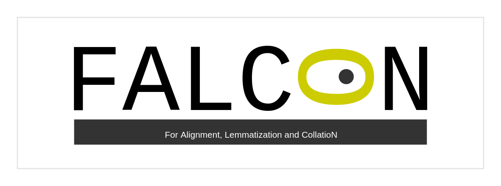

This repository contains scripts for a collation processing workflow and its evaluation.


## Installing

```bash
# Recommended steps (use virtualenv)
virtualenv env -p python3.8
source env/bin/activate
# end recommended steps

# begin install
pip install -r requirements.txt
```

### Language models with pie-extended

Models will be installed automatically if they are not. 

You can get a list of available models with

```bash
pie-extended list
```

## Sample usage

```bash
# Lemmatise raw (txt) files for ulterior collation
python3 main.py <path> [--lemmatise] [--lang] [--engine]

# Collate annotated files in XML
# containing (possibly human-corrected) linguistic information
python3 main.py <path> [--collate]

# Assign categories (graphematic, flexional, morphosyntactic, lexical) to the variation sites
python3 main.py <path> [--categorise]

# Or, alternatively, do it all in one row
python3 main.py <path> [--lemmatise] [--lang] [--engine] [--collate] [--categorise]
```

To evaluate the results:

```bash
python eval.py <path_to_gt_xml> <path_to_results_xml> [--print_diff]
```

For simple collation from the txt sources, without preprocessing:

```bash
python main.py <path> [--simple]
```


More info about usage and examples are available <a href="#info">below</a>.

## Format for XML annotated files

If you want to use directly XML annotated files,
they must be in TEI, and contain `<w>` tags,
with `@lemma`, and possibly `@pos` and `@msd` tags,

```xml
<w 
  lemma="mëisme" 
  pos="ADJind" 
  msd="NOMB.=s|GENRE=m|CAS=r"
>meisme</w>
```
Or, possibly, use an `@type`,

```xml
<w 
  lemma="mëisme"
  type="ADJind|NOMB.=s|GENRE=m|CAS=r"
>meisme</w>
```


<span id="info"></span>
## Examples and usage additional info

### Lemmatisation

```bash
# Lemmatise raw (txt) files for ulterior collation
python3 main.py <path> [--lemmatise] [--lang] [--engine]
# Example
python3 main.py data/input --lemmatise --lang fro --engine pie
```

This step takes txt files and produces annoted XML files, which will be saved in the directory `lemmat`. Attention: when you lemmatise different sources, define the path to the output directory to store the different results separately; the default path is `out`, which will produce `out/lemmat`.

The only currently available engine is [pie](https://github.com/emanjavacas/pie) in [pie-extended](https://pypi.org/project/pie-extended/). For a list of available models, type

```bash
pie-extended list
```


### Collation

```bash
# Collate annotated files in XML
# containing (possibly human-corrected) linguistic information
python3 main.py <path> [--collate]
# Example
python3 main.py data/input --collate
```

This step takes XML files and collate them. The results are saved in XML and in txt (as a table) in the directory `coll` (the default path is `out`, which will produce `out/coll`). 

Before collating, you might want to correct the XML generated by the previous step. For avoiding over-writing, move the XML files to a new directory before editing them and edit the path accordingly before launching the command.


### Categorisation

```bash
# Assign categories to the variation sites
python3 main.py <path> [--categorise]
# Example
python3 main.py put/coll/out.xml --categorise
```

This step takes the XML result of the collation and assign a category to each variation site.

The linguistic information on each `<rdg>` inside the `<app>` is used to assign the category: for example, if the `<rdg>`s have the same value of `@lemma`, `@pos` and `@msd`, the variation will be graphematic. The category is stored in the attribute `@ana` on the `<app>`. Currently supported categories are graphematic, flexional, morphosyntactic, lexical.


### All together

```bash
python3 main.py <path> [--lemmatise] [--lang] [--engine] [--collate] [--categorise]
# Example
python3 main.py data/input --lemmatise --lang fro --engine pie --collate --categorise
```
